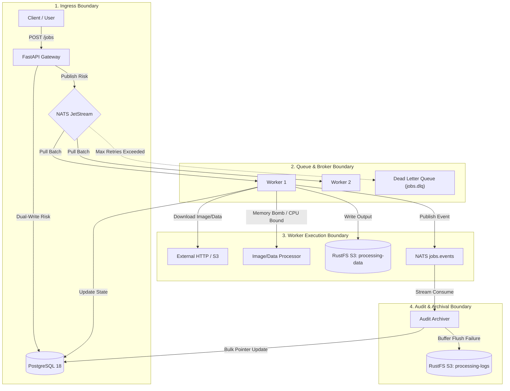

# Failure Modes & Resiliency Guide

A comprehensive architectural analysis of single points of failure (SPOF), transient errors, distributed state edge-cases, and their mitigations across the distributed processing engine.

---

## 1. System Failure Boundaries



---

## 2. Failure Mode & Effects Analysis (FMEA Matrix)

| Failure Scenario | Component Affected | Severity | Root Cause | Impact | Mitigation Strategy |
| :--- | :--- | :--- | :--- | :--- | :--- |
| **Dual-Write Inconsistency** | API Gateway | **High** | DB insert succeeds, but NATS publish fails (or vice versa). | Ghost job in DB stuck in `PENDING`, or job in NATS with no DB record. | In-memory compensation rollback + Transactional Outbox pattern / periodic background reconciler. |
| **Worker OOM / Decompression Bomb** | Worker Pool | **Critical** | Huge/corrupted image payload (e.g. 100,000×100,000 pixel bomb). | Worker process crashes abruptly mid-job. | `Pillow.Image.MAX_IMAGE_PIXELS` limit, payload size guards, and NATS JetStream `AckWait` timeout for automatic redelivery to another worker. |
| **Poison Message (Repeated Panic)** | Worker Pool / Queue | **High** | Malformed payload crashes every worker that attempts it. | Head-of-line blocking and cascading worker crashes. | Exponential backoff retry counter (`retry_count`) + automatic DLQ routing (`jobs.dlq`) with `msg.term()`. |
| **External HTTP Timeout / Stall** | Worker Pool | **Medium** | Remote image source drops connection or responds slowly. | Worker thread/coroutine blocked indefinitely. | Strict client timeout (`httpx.AsyncClient(timeout=15.0)`), bounded concurrency semaphore, and connection pooling. |
| **Audit Consumer Buffer Loss** | Audit Archiver | **Medium** | Audit container crashes while holding un-flushed events in RAM. | Gap in S3 audit `.jsonl.gz` logs (DB state remains intact). | Dual flush triggers (100 events or 15s), JetStream durable subscriber tracking last-acked event sequence. |
| **PostgreSQL Connection Exhaustion** | Storage Layer | **High** | Heavy concurrent burst exhausts database connection pool. | `asyncpg.TooManyConnectionsError`, API returns 500. | Connection pool sizing (`min_size=10, max_size=30`), statement timeouts, and queue-based backpressure. |
| **S3 Rate Limiting / 503 Slow Down** | Storage Layer | **Medium** | Massive parallel image upload bursts overload object store. | Artifact uploads fail. | Exponential retry with jitter in S3 client (`aioboto3`), structured S3 key partitioning. |
| **NATS Broker Disk Full** | Broker Layer | **Critical** | Unbounded message retention fills `/data/jetstream`. | NATS rejects new publications. | `RetentionPolicy.LIMITS`, stream message/byte limits, and TTL discarding. |

---

## 3. Deep-Dive Failure Modes & Mitigations

### 3.1. Ingress & Dual-Write Inconsistency

#### The Problem:
When submitting a job via `POST /jobs`, the API must perform two network operations:
1. Write `PENDING` record to PostgreSQL.
2. Publish job payload to NATS JetStream `jobs.request`.

If the database write succeeds but NATS is unreachable (or vice versa), the system enters an inconsistent state:
- **Case A**: Row exists in PostgreSQL with `status='PENDING'`, but no NATS message exists $\rightarrow$ Job is never picked up.
- **Case B**: NATS message is delivered, but worker fails to find the `job_id` in PostgreSQL $\rightarrow$ Worker throws DB foreign key / missing record exception.

#### Mitigations:
1. **Immediate API Rollback (Implemented)**:
   The API wraps both operations in a `try...except` block. If NATS publish fails, the API deletes the temporary `PENDING` row and returns HTTP 503 to the client.
2. **Reconciliation Sweeper (Production Recommendation)**:
   A lightweight background cron checks for jobs stuck in `PENDING` longer than 60 seconds with no worker activity and republishes them to NATS.
3. **Transactional Outbox Pattern (Enterprise Scale)**:
   Insert the job into a PostgreSQL `outbox` table within the same transaction. A Debezium CDC (Change Data Capture) connector or Postgres `LISTEN/NOTIFY` stream feeds NATS directly from the transaction log.

---

### 3.2. Worker Execution & Poison Messages

#### The Problem:
A "poison message" is a job whose payload triggers an unhandled crash (e.g. segmentation fault, memory leak, infinite loop, or unhandled library exception). If not handled properly, every worker that pulls the message will crash, causing a **cascading cluster outage**.

#### Mitigations:
1. **Pillow Image Decompression Bomb Protection (Implemented)**:
   Pillow automatically rejects images that exceed configured pixel thresholds (`Pillow.Image.MAX_IMAGE_PIXELS = 89_478_485`), preventing memory exhaustion attacks.
2. **Global Try/Catch & Error Capture (Implemented)**:
   [`JobRunner.execute()`](file:///Users/quan/workspaces/distributed-processing/src/distributed_processing/worker/runner.py) captures all base exceptions, records the exact stack trace in PostgreSQL (`status='FAILED'`, `error_message='...'`), and emits a `FAILED` event to NATS.
3. **JetStream Dead Letter Queue (DLQ) Routing (Implemented)**:
   - When a job fails permanently, the worker terminates the message (`msg.term()`) or publishes the failed context to `jobs.dlq`.
   - NATS will **not** redeliver terminated messages to active workers.

```python
# Worker exception containment in runner.py
try:
    result = await processor.process(payload, ctx)
    await self.db.update_job_status(job_id, "COMPLETED", result=result)
    await msg.ack()
except Exception as exc:
    await self.db.update_job_status(job_id, "FAILED", error_message=str(exc))
    await self.publish_event(self.cfg.nats_subject_dlq, payload_bytes)
    await msg.term() # Stop redelivery loop
```

---

### 3.3. Worker Crash Mid-Flight (In-Flight Failover)

#### The Problem:
A worker claims a job from NATS JetStream, transitions PostgreSQL to `PROCESSING`, and suddenly dies (e.g., host OOM killer, node termination, power outage).

#### Mitigations:
1. **NATS JetStream `AckWait` (Implemented)**:
   JetStream tracks consumer in-flight messages. If a worker does not acknowledge (`msg.ack()`) within `ack_wait` (default: 30s), NATS marks the message as unacknowledged and **automatically redelivers it to another healthy worker**.
2. **Idempotent Job Execution (Implemented)**:
   Every job uses deterministic S3 artifact keys based on its unique `job_id`:
   `s3://processing-data/processed/{job_id}_{operation}.jpg`
   If a second worker picks up the retried task, it overwrites the artifact cleanly without duplicate file generation.

---

### 3.4. Decoupled S3 Audit Archival Loss

#### The Problem:
The Audit Archiver buffers events in an in-memory list before writing compressed `.jsonl.gz` batches to S3. If the audit container crashes while holding 80 events in RAM:
- S3 log archive for those 80 events would be lost if NATS broadcast is purely ephemeral.

#### Mitigations:
1. **Dual Flush Triggers (Implemented)**:
   - **Size Trigger**: Flushes immediately upon reaching `audit_batch_size` (100 events).
   - **Time Trigger**: A background asyncio timer flushes unwritten events every `audit_flush_interval_seconds` (15s), minimizing the in-flight risk window.
2. **JetStream Durable Consumer for Audit (Production Hardening)**:
   Instead of core NATS pub/sub broadcast, the Audit service uses a durable JetStream consumer (`audit-archiver`) on `jobs.events`. The audit service only ACKs the event stream *after* the S3 `.jsonl.gz` upload succeeds and the DB pointer is written.

---

### 3.5. PostgreSQL & S3 Overload / Backpressure

#### The Problem:
A burst of 10,000 incoming jobs threatens to exhaust database connection pools or trigger S3 HTTP 503 Slow Down rate limits.

#### Mitigations:
1. **Queue Decoupling as a Shock Absorber (Implemented)**:
   FastAPI does not process jobs synchronously. It quickly writes the initial row, drops the message into NATS JetStream, and returns HTTP 200.
2. **Worker Concurrency Bounding (Implemented)**:
   Each worker uses an `asyncio.Semaphore(cfg.worker_concurrency)` (default: 5 concurrent tasks). Even under 50,000 queued messages, workers pull tasks at a controlled, constant rate without overloading PostgreSQL or RustFS S3.
3. **Async Connection Pooling (Implemented)**:
   `asyncpg` connection pools (`min_size=10, max_size=30`) ensure queries reuse established TCP connections with zero connection overhead.

---

## 4. Production Hardening Checklist

When moving from this standalone deployment to a distributed multi-zone production cluster:

- [ ] **NATS High Availability**: Deploy NATS in a 3-node or 5-node cluster with RAFT stream replication (`StreamConfig(replicas=3)`).
- [ ] **PostgreSQL High Availability**: Deploy with streaming replication, read-replicas, and connection poolers (PgBouncer).
- [ ] **S3 Object Lifecycle**: Set S3 lifecycle rules on `processing-logs/` to transition `.jsonl.gz` batches to Glacier/Archive after 90 days.
- [ ] **Ingress Rate Limiting**: Enable token-bucket rate limiting (`slowapi`) on `/jobs` to prevent DDoS abuse.
- [ ] **Graceful Shutdown Hooks**: Ensure SIGTERM signals in Kubernetes / Docker give workers a 30s grace period to complete in-flight tasks and flush audit buffers before process exit.
- [ ] **Alerting Rules**: Set Prometheus alerts in Grafana for:
  - `jobs_db_total{status="FAILED"} > 10`
  - `sum(rate(jobs_failed[5m])) > 0.05` (Failure rate > 5%)
  - `sum(active_workers) == 0` when `jobs_db_total{status="PENDING"} > 100` (Worker starvation).
